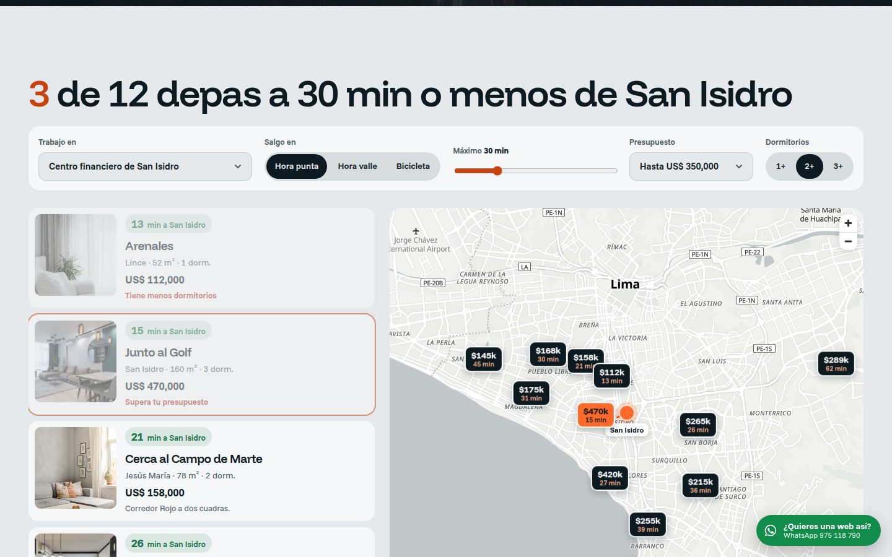
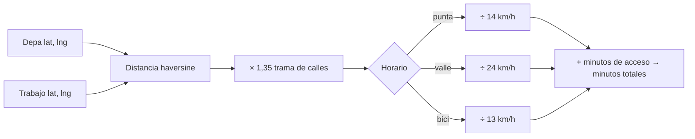
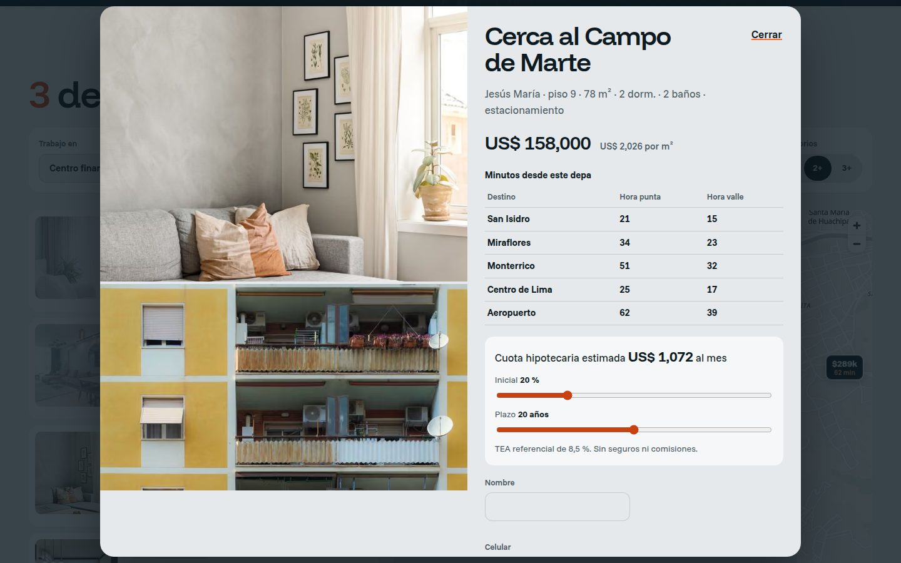
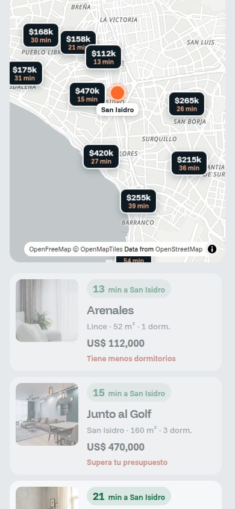

# Cerca — departamentos en Lima por minutos al trabajo

**Demo en vivo:** https://landing-real-estate-danielyatacoblas-projects.vercel.app


## El problema

En Lima no se compra un departamento, se compra un **trayecto**. Dos depas al mismo precio pueden significar 20 o 70 minutos diarios en hora punta, pero los portales inmobiliarios filtran por distrito, como si Miraflores quedara igual de cerca de San Isidro que de Monterrico.

Cerca es una inmobiliaria ficticia que invierte la búsqueda: **eliges dónde trabajas y cuántos minutos aceptas**, y el mapa te muestra qué depas cumplen, en hora punta, hora valle o bicicleta.

## Qué hace

| Sección | Qué resuelve | Técnica |
|---|---|---|
| Hero | Empezar por lo que importa | Formulario "¿dónde trabajas?" sobre la Costa Verde al atardecer; titular por líneas con GSAP |
| Buscador | Encontrar depas por tiempo | Filtros por trabajo, horario, minutos, presupuesto y dormitorios; título vivo "3 de 12 depas a 30 min…"; cada tarjeta dice por qué queda fuera |
| Mapa | Ver la ciudad real | **MapLibre GL** con estilo de OpenFreeMap (sin API key), pines con precio y minutos, marcador del trabajo y línea de trayecto al pasar el cursor; se descarga solo al acercarse |
| Ficha | Decidir | Tabla de minutos a cinco destinos en punta y valle, precio por m², cuota hipotecaria con sliders y agenda de visita |
| Cómo medimos | Ser honestos | Fórmula explicada en texto, sin prometer tiempo real |



## Cómo se estima el tiempo



La fórmula vive en [`lib/commute.ts`](lib/commute.ts), con pruebas en [`tests/commute.test.ts`](tests/commute.test.ts):

```bash
npm test
# ✔ distancia conocida: Óvalo Gutiérrez a Plaza San Martín ≈ 6,4 km en línea recta
# ✔ el mismo punto tarda solo el tiempo de acceso
# ✔ en hora punta siempre se tarda más que en hora valle
# ✔ un depa en San Isidro queda más cerca del centro financiero que uno en Chorrillos
# ✔ hipoteca: sin tasa es una división simple y con tasa paga más
```



## Stack

- **Next.js 16** + **React 19** + **TypeScript** estricto, prerender estático
- **MapLibre GL 5** (import dinámico) + **OpenFreeMap** como mapa base libre
- **GSAP 3 + ScrollTrigger** y **Lenis**
- Funnel Display y Funnel Sans con `next/font`
- `node:test` para el modelo de tiempos y la hipoteca; **Supabase** opcional para visitas; **Vercel**

## Diseño

- Hecho con las skills de [Impeccable](https://impeccable.style/) y [Emil Kowalski](https://github.com/emilkowalski/skills).
- Paleta del cielo gris de Lima (garúa), azul noche del Pacífico y el naranja de las estelas del tráfico al atardecer.
- Si el mapa no carga, la lista sigue funcionando y lo dice. En móvil el mapa va arriba y la lista abajo.
- Los depas fuera de filtro no desaparecen: se atenúan y explican el motivo ("fuera de tu tiempo por 4 min").



## Correr local

```bash
npm install
npm run dev
npm test
npm run build
```

## Créditos

- Fotografía: [Pexels](https://www.pexels.com). Mapa: [OpenFreeMap](https://openfreemap.org), © OpenMapTiles, © colaboradores de OpenStreetMap.
- Cerca es ficticia: departamentos, precios y ubicaciones aproximadas son de demostración; los tiempos son estimaciones.

## Contacto

¿Quieres una web así para tu negocio? Escríbeme por WhatsApp al **[975 118 790](https://wa.me/51975118790)**.

---

Diseñado y desarrollado por [Daniel Yataco](https://github.com/danielyatacoblas).
